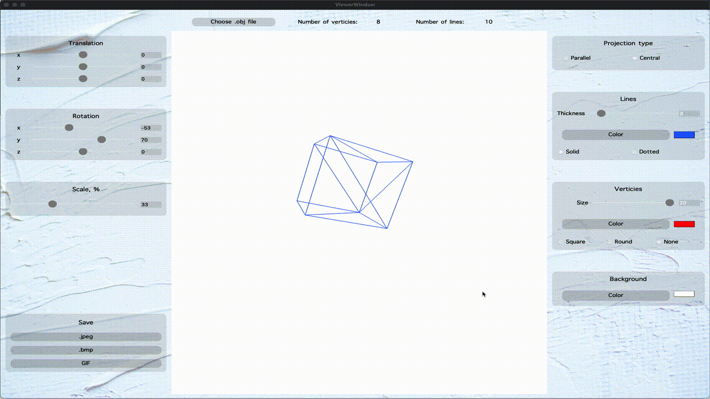

## 3DViewer_v1.0
## Реализация приложения для просмотра 3d-моделей в формате .obj

## Сборка:
Для установки проекта на компьютере должны быть установлены следущие зависимости:
- gcc(g++)
- make
- OpenGL
- CMake
- Qt5
- Qt5::Core
- Qt5::Gui
- Qt5::Widgets
- Qt5::OpenGLWidgets

Клонируем репозиторий, переходим в дирректорию src и пишем в консоль `make install`. После того, как приложение запустится, нажав на кнопку "Choose .obj file" выбираем файл с моделью. В дирректории src/models находятся тестовые экземпляры моделей.

## Функционал:
- выбор типа проекции(параллельная, центральная)
- выбор типа линий(сплошная, пунктирная)
- выбор толщины и цвета линий
- выбор режима отображения вершин(квадратные, круглые, без отображения)
- выбор толщины и цвета вершин
- выбор цвета заднего фона
- сохранение скриншотов в формате .jpeg или .bmp
- запись gif-изображения

